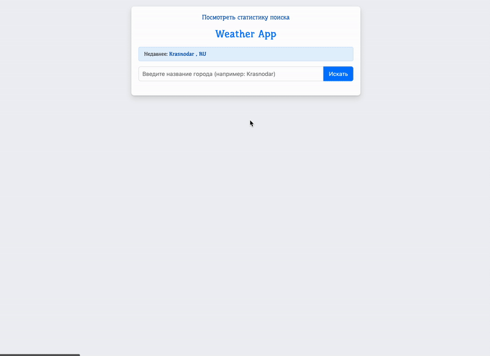

# Weather App

Сервис для отображения погоды с возможностью поиска.

<p align="center">
    
</p>


## 🎯 Возможности

- Поиск по городам
- Автодополнение при вводе
- Сохранение предыдущего поиска погоды
- Сохранение поиска для каждого пользователя
- Визуализации статистики
- Простой запуск при помощи докера
- Smoke тесты

## 🚀 Быстрый старт

```bash
git clone https://github.com/tofutych/o-complex-test-task.git
cd o-complex-test-task
docker-compose up --build
```

## 🛠️ Использованные технологии

### Бэкенд

*   **[FastAPI](https://fastapi.tiangolo.com/):**
    *   **[Uvicorn](https://www.uvicorn.org/)** 
    *   **[Pydantic](https://docs.pydantic.dev/)** 
*   **База данных:**
    *   СУБД — **[PostgreSQL](https://www.postgresql.org/)** 
    *   ORM — **[SQLAlchemy](https://www.sqlalchemy.org/)** 
        *   Миграции — **[Alembic](https://alembic.sqlalchemy.org/)** 
    *   Драйвер — **[Asyncpg](https://github.com/MagicStack/asyncpg)**
*   **HTTP-клиент:**
    *   **[HTTPX](https://www.python-httpx.org/)**

### Фронтенд

*   **[HTMX](https://htmx.org/)**
*   **Шаблонизатор — [Jinja2](https://jinja.palletsprojects.com/)**
*   **Визуализация данных — [Chart.js](https://www.chartjs.org/)**
*   **Стилизация:**


